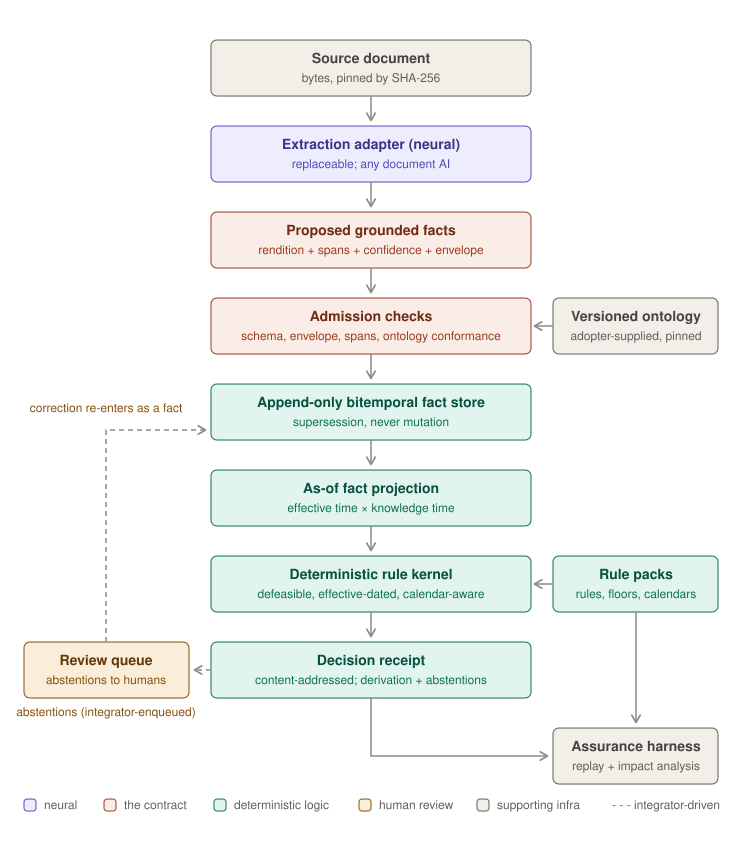

```text
██████╗ ██╗   ██╗██╗  ██╗   ██╗
██╔══██╗██║   ██║██║  ╚██╗ ██╔╝
██║  ██║██║   ██║██║   ╚████╔╝
██║  ██║██║   ██║██║    ╚██╔╝
██████╔╝╚██████╔╝███████╗██║
╚═════╝  ╚═════╝ ╚══════╝╚═╝
```

### Decisions on documents that replay byte-for-byte, years later, with a receipt.

<p align="center">
  <strong>
    <a href="#quick-start-60-seconds">Quick start</a> ·
    <a href="docs/demo_tour.md">Demo tour</a> ·
    <a href="docs/neuro-symbolic-architecture.md">Architecture</a> ·
    <a href="spec/grounded-facts.md">Specs</a> ·
    <a href="docs/faq.md">FAQ</a>
  </strong>
</p>

[](https://github.com/kjpatel/duly/actions/workflows/ci.yml)
[](LICENSE)
[](pyproject.toml)
[](examples/golden/README.md)
[](spec/compatibility.md)

*duly* — as in duly authorized, duly recorded, duly noted: in accordance with proper procedure.

duly is an open-source toolkit for building neuro-symbolic document-decisioning systems: a neural layer reads unstructured documents and *proposes* structured facts; a deterministic symbolic layer applies a versioned, effective-dated rulebase to *decide* what those facts mean. Perception proposes, logic disposes. Every conclusion arrives with the rule that fired, the fact it fired on, and the clause the fact came from — an answer plus a receipt.

## Quick start (60 seconds)

```bash
git clone https://github.com/kjpatel/duly && cd duly && uv sync
```

The property everything else is built on, in nine lines: **the same file, adjudicated
under the rules in force on two different dates.**

```python
import glob, json, yaml
from duly_kernel import adjudicate

facts = [json.load(open(p)) for p in sorted(glob.glob("examples/golden/cases/notice-ny-0010/facts/*.json"))]
pack = yaml.safe_load(open("examples/rulepacks/termination-notice-us-states/pack.yaml"))

for effective in ("2025-06-01", "2026-06-01"):        # one file, two rulebooks
    r = adjudicate(facts, pack, effective, "2026-08-04T12:00:00Z", "nc:noticeCompliant")
    rules = " ".join(x["ruleId"] for x in r["rulesFired"])
    print(f'as of {effective}   compliant={str(r["decision"]["value"]["value"]):5}'
          f'   {rules:32} receipt {r["receiptSha256"][:12]}…')
```

```text
as of 2025-06-01   compliant=True    NC-DEF-00 NY-NR-45-LEGACY        receipt b96da8d45106…
as of 2026-06-01   compliant=False   NY-NR-45 NC-NR-01                receipt 5a6b701ef373…
```

Same notice, opposite answers, and neither is a guess: each receipt names the rule
that decided, the statute it cites, the facts it consumed by content hash, and the
presumption it defeated. Hand either receipt to someone who does not trust you and
they can re-run it.

**Then see it whole** — four browser surfaces over the same engine: the decision
workspace, a rule studio, an evidence browser with a knowledge-time dial, and a
receipt viewer that re-verifies anything you paste into it.

```bash
uv run uvicorn duly_demo.app:app --port 8788     # → http://localhost:8788
```

**And check the claim**, which takes one command and about ten seconds:

```bash
uv run python -m duly_assurance verify      # → verified 351 cases
```

That is every committed decision in the repository re-adjudicated from its facts and
its pack, and compared byte-for-byte against the receipt committed months earlier.

> [!IMPORTANT]
> **Before you build on it — pre-1.0, and honest about which parts.** The fact,
> receipt and rule-IR contracts are **frozen**:
> [what v1.0 promises, per contract](spec/compatibility.md), including what it
> deliberately does not cover. Not yet on PyPI — installation is `git clone`
> until the v1.0 release. The SQLite stores and in-process demo are a reference
> wiring, not a deployment blueprint. Demo content that is invented rather than
> real is labelled `DEMO-SYNTHETIC` in the file that carries it.

### Where to go next

| If you want | Read |
|---|---|
| To watch it run before reading about it | [demo tour](docs/demo_tour.md) |
| The system mental model, for platform engineers | [architecture guide](docs/neuro-symbolic-architecture.md) |
| The ~20 terms this repo uses precisely | [concepts](docs/concepts.md) |
| The actual bytes: PDF text → receipt → correction | [follow one fact](docs/follow-one-fact.md) |
| The objection you are about to raise | [FAQ](docs/faq.md) |
| The contract, argued decision by decision | [grounded facts](spec/grounded-facts.md), [rule IR](spec/rule-ir.md) |
| To write a rule pack | [examples/rulepacks/README.md](examples/rulepacks/README.md) |
| To contribute, or to point an agent at it | [CONTRIBUTING.md](CONTRIBUTING.md), [CLAUDE.md](CLAUDE.md) |

## The problem

In regulated domains — insurance manuscripts, mortgage closing packages, healthcare claims, KYC files, customs declarations — reading the documents was never the hard part. The hard part is that every conclusion must be:

- **defensible** to a regulator or auditor, citing the exact rule and the exact source text;
- **reproducible** months or years later, byte-for-byte;
- **evaluated under the rules as they stood** on the transaction date, not today's rules.

A model that is right 95% of the time and cannot show its work is unusable here, because the output isn't the answer — it's the answer plus an auditable chain. And the expensive failure mode isn't being wrong; it's being *confidently* wrong. The architecture duly supports converts confident wrongness into explicit abstention routed to a human.

The individual pieces of this architecture already exist as open source: Datalog engines, document AI, rules-as-code DSLs, graph stores, provenance vocabularies. What doesn't exist is the **seam** — a standard for how a probabilistic extractor hands facts to a deterministic reasoner with source spans, calibrated confidence, abstention semantics, and bitemporal versioning intact, plus a kernel that can replay any decision as of any date. Today, every team building one of these systems writes that layer themselves.

duly is that seam.

## Architecture

<p align="center">
  
</p>

Everything above the contract is probabilistic and replaceable; everything below it is deterministic and replayable. Extractors and models can be swapped at the contract line without touching the reasoning layer — the approach OpenTelemetry took for telemetry: standardize the interchange format, ship adapters, and let the ecosystem form around the format rather than around any single engine.

| Piece | What it is | Status |
|---|---|---|
| [Grounded fact contract](spec/grounded-facts.md) | The interchange format: facts with provenance, confidence, and bitemporal fields; decision receipts with derivation trees | v0 shipped |
| [Rule IR](spec/rule-ir.md) | Defeasible rules — priority, overrides, legal citation, effective window — in a YAML authoring format; Datalog/ASP compilation targets come later | v0 shipped |
| [Reference kernel](kernel/) | Deterministic interpreter: typed expressions (decimal-only money), stratified evaluation, defeat semantics, effective-dated rule selection, receipt emission | working, tested |
| [Audit report renderer](kernel/duly_kernel/report.py) | Deterministic derivation-tree → layered report for compliance and technical readers ([example](docs/example-audit-report.md)). One section structure, three renderers over it — Markdown, PDF, and JSON blocks for the browser — so a new medium is a new walk, not a second report | working |
| [Rule packs](examples/rulepacks/) | Insurance: state termination-notice timing (NY/FL/CA). Mortgage closing: TRID fee tolerance, RON eligibility by state (real authorization dates, incl. California's not-until-2030 statute), eSign/eNote signing-method routing (ESIGN + GSE eNote requirements), TILA right of rescission (12 CFR 1026.23), and county recording readiness (CA/AZ) — each rule cited to its statute or marked TODO(verify), with declared expected outcomes run in CI | six packs, two domains |
| [Starters](examples/starters/) | Synthetic documents, extracted renditions, and span-verified grounded facts for every vertical ([layout and tooling](examples/starters/README.md)) | six shipped |
| [Demo](duly_demo/) | Interactive adjudication UI: highlighted grounding spans, derivation tree, rule citations, receipts, as-of replay, and the review arc — abstention, inline correction, golden-case export. Ships in the wheel as `duly_demo`, static assets included, so `uvicorn duly_demo.app:app` needs no checkout | working |
| [Rule studio](docs/demo_tour.md#10-the-rule-studio) | The demo's second surface, for the rules rather than the documents: every pack rendered as decision-table grids, editable as cells, forms or YAML, with the validator, the pack's declared cases, an ad-hoc case, golden-corpus impact and the solver all run over one in-memory draft. Drafts are session-only — it hands you `pack.yaml` and a diff, and committing stays a human act | working |
| [Evidence browser](docs/demo_tour.md#11-the-evidence-browser) | The demo's third surface, for the evidence rather than the answer: every document a case holds (source bytes beside the extractor's rendition) and every fact ever asserted about it, each with its provenance, confidence, content hash, ontology slot and supersession chain. A knowledge-time dial replays the store's event log — drag it back and a correction becomes not-yet-known, the fact it replaced goes live again, and the citations move with it | working |
| [Receipt viewer](docs/demo_tour.md#12-the-receipt-viewer) | The demo's surface for a receipt that already exists: search the 351 committed receipts by case id or hash, or paste one from anywhere, read it as the kernel's audit report, and see it re-verified on open — its own hash, its facts' content hashes, and a full re-adjudication. A forged receipt that was re-sealed passes the first two and fails the third, which is the reason there are three | working |
| [Extraction adapters](extraction/) | Document AI providers emitting contract-conformant facts with verified run envelopes | Docling + scripted stub; commercial adapters deferred to v1.1 |
| [Bitemporal fact store](store/) | Append-only events, as-of projections across effective and knowledge time, supersession chains (SQLite; Postgres-portable schema) | working |
| [Review queue](review/) | Abstention routing; human corrections re-enter as first-class facts and auto-become golden cases; calibration label export | working (API + library) |
| [Calibration](calibration/) | Temperature/Platt/conformal calibrators and abstention math, consuming the review queue's labeled pairs | working |
| [Assurance harness](assurance/) | Replay verifier, 351-case [golden corpus](examples/golden/) (350 synthetic + 1 review-born), rule-change impact analysis with CI PR comments | working |
| [PROV-O export](spec/prov-o.md) | External JSON-LD contexts + exporter: facts and receipts become W3C PROV for any RDF/SPARQL tool, stored bytes unchanged — lineage queries with off-the-shelf tooling ([SPARQL demo](spec/provo_sparql_demo.py), `GET /api/report?format=jsonld`) | shipped |
| [Pack-embedded calendars](spec/rule-ir.md) | Business-day arithmetic inside the deterministic evaluator: `add_business_days` walks a calendar carried in the pack itself — excluded weekdays, cited holiday dates, and a hard coverage window that raises rather than guessing past its edge ([demo](spec/calendar_demo.py)). "Last Monday in May" is legal content, versioned and receipt-pinned with the rules that use it, not engine code | shipped |
| [DMN compiler](spec/dmn.md) | A second authoring surface: DMN 1.3+ decision tables compile into the rule IR, and the kernel cannot tell the result from a hand-written pack ([demo](spec/dmn_demo.py), `python -m duly_dmn`). Deliberately narrow — S-FEEL cells, three of seven hit policies, a mandatory citation and effective date on every row — and it refuses rather than approximates: an uncited row is a compile error, not an invented `TODO(verify)` | shipped |
| [What-if queries](spec/whatif.md) | Run the rulebase backwards: free one input of a decided case and ask which values reach an outcome, with the extremal one. The solver proposes; the kernel disposes — every answer is verified by re-adjudicating it, and no artifact is produced ([demo](spec/whatif_demo.py), `python -m duly_whatif`) | shipped |
| [Canonical form + content addressing](core/duly_core/) | The one implementation of what a duly document's bytes *are*, plus the JSON Schemas that define its shape — both shipped in the wheel so no package can disagree and no path reaches for the repository. Its answers are frozen in [`spec/canonical-vectors.json`](spec/canonical-vectors.json): eleven `(document, canonical bytes, digest)` triples any implementation in any language must reproduce | working |
| [Minimal integration example](examples/minimal-integration/) | duly consumed from outside at its smallest: three facts, three rules, one adjudication and one verified receipt in ~100 lines of author-owned code with its own ontology and pack, checked on every push against an installed wheel with duly's source tree absent | working |
| [Closing scheduler example](examples/closing-scheduler/) | duly as a decision component inside an optimizer: CP-SAT plans a mortgage closing where every hard constraint is a table of days an adjudication permitted, and every chosen date cites the receipt ids that constrained it. The scheduler encodes no rule — a test perturbs the TILA pack from three business days to five and requires the plan to move without `schedule.py` being edited | shipped |
| [Static pack verifier](spec/pack-verification.md) | Solver-backed validation-time analysis of a rulebase: proves same-priority rules mutually exclusive where the syntactic validator cannot, witnesses the overlaps it cannot prove away, enumerates the input regions no rule covers, and proves two packs decide alike over the input space instead of over a fixture list ([demo](spec/prove_demo.py), `python -m duly_assurance prove`) | shipped |
| [Compatibility policy](spec/compatibility.md) | What v1.0 promises, per contract, and what it deliberately does not cover. The receipt has no extension point and never will; replay is scoped to a **semantics version**, enforced by a kernel that refuses a receipt whose semantics it does not implement rather than replaying it by coincidence; and `decision_digest()` says when two receipts record the same adjudication — which is how two evaluation backends are defined to agree, since their bytes cannot ([demo](spec/compatibility_demo.py), [vectors](spec/decision-digest-vectors.json)) | shipped |
| [Ontology conformance gate](spec/ontology-conformance.md) | The enforcement half of bring-your-own-ontology: versioned LinkML artifacts ([examples/ontologies/](examples/ontologies/), two committed samples with a verified MISMO/FIBO crosswalk) + a pure-Python gate rejecting misspelled attributes, wrong value kinds, and out-of-enum codes at the contract line ([demo](spec/conformance_gate_demo.py), `python -m duly_conformance`) | shipped |

## What you keep and what you replace

duly is meant to be adopted the way you adopt a telemetry stack: the toolkit is yours to import, the content is yours to author. Everything in this repo is one of three kinds, and confusing them is the fastest way to misread the project:

| Kind | Directories | An adopting org… |
|---|---|---|
| **The toolkit** — the seam itself | `spec/`, `kernel/`, `store/`, `extraction/`, `conformance/`, `calibration/`, `review/`, `assurance/` | imports and runs these unchanged; they contain zero domain knowledge |
| **Example content** — what a *user* of the toolkit authors | `examples/rulepacks/`, `examples/starters/`, `examples/ontologies/`, `examples/golden/`, `examples/dmn/` | replaces these with its own rules, documents, ontologies, and regression corpus — ours exist to be read, copied, and deleted |
| **Reference wiring** | `duly_demo/`, `examples/minimal-integration/`, `examples/closing-scheduler/` | treats these as worked examples of tying the pieces into a service (`duly_demo/`) or of consuming duly from a system that is not duly, not as the product |

The six rule packs, seven scenarios, and 350-case synthetic corpus are teaching artifacts: dense enough to prove the machinery under real statutes, disposable by design. The procedural bring-your-own path — your extractors, your ontology, your packs, your corpus, end to end — is the adopter's guide roadmapped in M5 below; until it lands, [examples/rulepacks/README.md](examples/rulepacks/README.md) and the per-component READMEs cover each edge individually.

## Design choices and why

### Why neuro-symbolic at all

Pure-LLM approaches improve with every model release, and for most document work they are the right choice. duly targets the workflows where the requirement isn't capability but accountability:

- **The audit trail is a byproduct of evaluation.** A rules engine reports which rule fired on which fact from which clause. Prompted explanations cannot provide this, because a model's stated reasoning is not its actual reasoning.
- **Rule changes are code changes, not ML projects.** When a regulation changes, you edit a rule, version it, effective-date it. Nothing retrains; nothing silently regresses elsewhere.
- **Long-tail coverage without long-tail data.** You encode a county's recording rule once instead of collecting three hundred labeled examples of it — decisive when the tail is thousands of jurisdictions with a handful of files each.
- **Failure is legible.** The system can say "insufficient grounded facts" and route to a human, converting the expensive failure mode (confident wrongness) into a manageable one (abstention).

This approach carries known risks: it assumes regulators will continue to require determinism and provenance rather than accepting model output directly, and it inherits the classic expert-systems problem that knowledge engineering never ends. Both risks shape the roadmap — the ontology is bring-your-own, and the starting point is one narrow vertical slice rather than a comprehensive knowledge graph.

### Why the focus on the seam

Engines are replaceable; interchange formats compound. Datalog engines, document parsers, and graph stores all exist and keep improving. The glue between them is where implementations diverge and break: how confidence survives the handoff, how a span stays resolvable after the extractor upgrades, how a decision made in March stays replayable in November. Standardizing that layer is where a neutral open-source project adds the most value, and it is not a layer any single vendor is positioned to define.

### Why facts are atomic, typed, and content-addressed

A fact is one entity–attribute–value assertion with mandatory grounding (a document span or a human attestation), a calibrated confidence, and two time axes. Atomic facts ground directly into Datalog relations and carry per-assertion confidence — an extractor is often sure about a notice's mailing date and unsure about its stated ground for termination, and one score per record can't express that. Money is decimal strings, never floats: binary floating point is not acceptable where amounts must reconcile to the cent under audit. Facts are content-addressed (RFC 8785 canonical JSON + SHA-256), so receipts pin their inputs by hash and replay integrity is checkable byte-for-byte. Full rationale, decision by decision, in [the spec](spec/grounded-facts.md).

### Why bitemporal from birth

"Evaluate a March file under March rules, as we understood the facts in March" is the defining query of regulated replay, and it needs two independent time axes: *effective time* (when a fact or rule applies in the world) and *knowledge time* (when the system learned it). Retrofitting bitemporality onto a unitemporal store is a rewrite; carrying two timestamps from day one is nearly free. Facts are immutable — corrections supersede, and the supersession chain *is* the correction history.

### Why a defeasible IR compiled to stratified Datalog

Real rulebases are defaults and exceptions all the way down ("standard tolerance applies *unless* the fee is in the 10% bucket *unless* a changed circumstance reset the baseline"). Full answer-set programming handles this natively, but at a cost that is hard to justify in v1: the learning curve for contributors is steep, ASP explanation tooling remains immature — a serious problem when the receipt is the primary output — and multiple answer sets complicate the determinism guarantee. Plain Datalog has the opposite problem: hand-encoded exception plumbing makes rule packs hard to read and review.

duly follows the approach [Catala](https://catala-lang.org/) established for computational law: rules carry `priority` and `unless` metadata *declaratively in the IR*, and the compiler mechanically lowers them to stratified Datalog. Authors get explicit exception semantics; the engine stays deterministic; receipts show which rule **defeated** which, making the non-monotonic reasoning itself auditable. A clingo backend can be added later for rule fragments that genuinely need it, without changing any rule pack.

### Why bring-your-own ontology

duly ships no domain schema. MISMO, ACORD, FHIR, and FIBO already exist, and building a new domain ontology is a large undertaking that has stalled many efforts in this space. Facts reference the user's ontology by CURIE + version; duly validates conformance against the versioned LinkML artifact that reference pins (the [conformance gate](spec/ontology-conformance.md)) but defines no domain terms. This boundary also contains the knowledge-engineering burden: duly's core never grows domain knowledge, so it never accumulates domain debt.

### Why code-first

Specifications that develop ahead of running code rarely get adopted. The contract was developed against real vertical slices — termination-notice compliance and TRID fee tolerance, both now running end to end — and implementation promptly forced spec revisions (recorded in [spec/rule-ir.md](spec/rule-ir.md) under "Resolved in v0"), which is exactly the point. The spec stabilizes at v1.0; until then, breaking changes are expected.

### What duly deliberately is not

- **Not a knowledge graph platform.** Graph projections (SPARQL over Oxigraph/RDFox) come when cross-document reasoning genuinely demands them, not before.
- **Not an orchestration framework.** LangGraph, Temporal, and friends compose around duly; integration examples only.
- **Not a UI product.** The review queue ships as an API with defined queue semantics; review interfaces vary too much across organizations to standardize, and are left to integrators.
- **Not an extraction model.** Adapters wrap the extractors you already use; duly's job starts at the contract line.

## The demonstration

The milestone that validates the architecture end to end now runs. Seven scenarios ship with the repo, grouped by domain in the picker. Insurance: a New York homeowners nonrenewal notice and a review-arc variant whose extracted mailing date lands below the rule pack's confidence floor. Mortgage closing: a TRID transfer-tax tolerance check between a Loan Estimate and a Closing Disclosure, remote-online-notarization eligibility under real state authorization statutes (adjudicate the same California closing today and in 2030 — the outcome flips on SB 696's operative date), eSign/eNote signing-method routing for a closing package, a TILA right-of-rescission funding hold that clears only after the third *precise* business day (Saturdays count; Sundays and federal holidays do not — the 2026 Memorial Day window is the demo case), and a county recording-readiness check with its own below-floor extraction feeding the review arc:

```bash
uv sync                     # core install — extraction falls back to the scripted stub
uv sync --extra extraction  # optional: live Docling extraction in the demo (large install)
uv run uvicorn duly_demo.app:app --port 8788
```

Open http://localhost:8788, pick a scenario, and ask its question — or follow the step-by-step [demo tour](docs/demo_tour.md).  The document pane highlights the exact phrases each fact was grounded in; the reasoning pane shows the derivation tree (click a fact to jump to its source sentence), the rules that fired with their legal citations, and which presumption each rule defeated; the receipt downloads as JSON and the full audit report as Markdown or PDF ([example](docs/example-audit-report.md)). Change the as-of date and the same facts produce a different outcome under the rules in force at that date — the effective-dated replay the architecture exists to provide. In the review-arc scenario the decision abstains from the below-floor fact, falls to the presumption, and says so; an inline correction supersedes the shaky fact with a human-asserted one, flips the verdict on re-adjudication, and exports as a replayable golden regression case ([tour §9](docs/demo_tour.md)).

The same server has a second surface for the rules themselves: <http://localhost:8788/rules> renders every pack as decision-table grids you can edit as cells, forms or YAML, and puts the five instruments a rule change needs in one rail — the kernel's validator, the pack's declared `expected.yaml` outcomes, an ad-hoc case you build by changing input values, golden-corpus impact analysis over the draft, and (with `--extra prove`) a solver proof of whether the draft and the committed pack decide alike. The stock demonstration is watching two of them disagree: change New York's 45-day minimum to 60, and every declared case still passes while the corpus reports one flipped decision — declared outcomes catch a pack that *breaks*, only the corpus catches one whose *meaning moved*. Drafts live in the process and are never written into `examples/rulepacks/`; the studio hands you `pack.yaml` and a diff, and committing is a human act ([tour §10](docs/demo_tour.md#10-the-rule-studio)).

A third surface is for the evidence: <http://localhost:8788/evidence> shows a case's documents — the committed PDF beside the extractor's rendition, with the spans drawn only on the rendition they are measured in — and every fact ever asserted about it, each with its provenance, confidence method, content hash, ontology slot, and the questions that cite it. The strip along the top is a knowledge-time dial whose stops are the moments the case's knowledge actually changed. Drag it back past the review arc's correction: the corrected fact becomes not-yet-known, the below-floor machine fact it superseded goes live again, and the citations move with them. Nothing is stored to make that work — it is the same append-only event log projected at a different horizon, which is what "bitemporal" has meant here since M2 and what nothing until now displayed ([tour §11](docs/demo_tour.md#11-the-evidence-browser)).

No browser needed for the core of it — the same decision from the terminal, including the as-of flip:

```bash
uv run python -m duly_kernel --facts examples/starters/notice-ny/facts \
  --pack examples/rulepacks/termination-notice-us-states/pack.yaml \
  --asof 2026-07-29 --question nc:noticeCompliant
# → "value": false — 38 days notice given, 45 required under NY-NR-45
uv run python -m duly_kernel --facts examples/starters/notice-ny/facts \
  --pack examples/rulepacks/termination-notice-us-states/pack.yaml \
  --asof 2025-06-01 --question nc:noticeCompliant
# → "value": true — same facts, compliant under the rule then in force
# add --report audit.md (or --report-pdf audit.pdf) for the full audit report
```

Honest labels on the demo content: the documents are synthetic (generated by [examples/starters/tools](examples/starters/tools/) and per-starter scripts, with facts span-verified against the actual PDF text); extraction runs the Docling adapter when the `extraction` extra is installed and the honest scripted stub otherwise, with the UI labeling which extractor produced the rendition; the below-floor confidences (0.62 in the notice review arc, 0.58 in the recording scenario) are scripted so the abstention arc is reproducible; and the pre-2026 "30-day" historical rule version exists only to demonstrate effective-dated replay — it is marked `DEMO-SYNTHETIC` in the pack and is not real statutory history. The RON pack's effective dates, by contrast, are real statutory history — that is its point.

## Roadmap

What is planned and what is done. What each shipped milestone *turned out to mean* — the boundaries that moved, the claims that were corrected, the things that could not be done honestly — is in the [changelog](CHANGELOG.md), so this stays a plan rather than becoming a record.

Sequencing principle: build nothing until its consumer exists — where a consumer is a workload, ours or an adopting org's, not a hypothesis. Each milestone ends in something demonstrable; when a capability's natural consumer is an adopter (constraint queries, scheduling), the examples grow to become that consumer rather than the capability waiting indefinitely.

### M0 — the contract (complete)
- [x] Grounded fact spec: ten design decisions with rationale ([spec/grounded-facts.md](spec/grounded-facts.md))
- [x] JSON Schemas for `GroundedFact` and `DecisionReceipt`
- [x] Worked example with real content hashes: New York nonrenewal notice-period check (N.Y. Ins. Law § 3425)
- [x] Validator: schema + hash + referential-integrity checks

### M1 — end-to-end vertical slice (complete)
- [x] Rule IR: defeasible rules with priority, overrides, legal citation, and effective window ([spec/rule-ir.md](spec/rule-ir.md), including two design questions resolved during implementation)
- [x] Reference interpreter (pure Python, optimized for derivation-trace quality, not speed)
- [x] Two starters end to end — NY termination notice and federal TRID fee tolerance: sample documents → facts → adjudication → receipt
- [x] Interactive demo UI: grounding-span highlighting, derivation tree, citations, defeated-rule badges, as-of replay
- [x] First end-to-end run of the target demonstration (the as-of outcome flip)
- [x] Audit report renderer: deterministic, layered Markdown + PDF ([example report](docs/example-audit-report.md)), with PII quote redaction
- [x] Spec closeout: conflict-resolution policy (a lone human assertion outranks machine facts; all other conflicts abstain) and fact `sensitivity` field — both implemented and tested; batch envelopes deferred to M3

### M2 — replay and regression (complete)
- [x] Bitemporal fact store ([store/](store/)): append-only events on SQLite with a Postgres-portable schema; as-of projections across knowledge and effective time; supersession chains and knowledge-time travel ("what did we know in March") tested end to end
- [x] Replay verifier: `python -m duly_assurance verify` re-adjudicates every golden case and asserts byte-identical receipts
- [x] Golden corpus ([examples/golden/](examples/golden/)): 350 committed synthetic cases with receipts, seeded and deterministically regenerable, exercising every rule in every pack including effective-date boundaries and defeat chains (extended in M4 when the mortgage-closing packs landed)
- [x] Rule-change impact analysis in CI: PRs touching `examples/rulepacks/` get a sticky comment — "N of M decisions flip" — with before/after receipts and reasoning-only-change tracking ([.github/workflows/ci.yml](.github/workflows/ci.yml))
- [x] Florida and California rule packs, statutorily verified (Fla. Stat. § 627.4133; Cal. Ins. Code §§ 678, 677.4) with explicit scope comments and TODO(verify) markers; jurisdiction scoping validated by equality-guard disjointness in the pack validator

### M3 — extraction and review (complete)
- [x] Extraction adapter interface + Docling adapter ([extraction/](extraction/)): rendition-anchored spans verified on every emission; the demo's scripted stub is adapter #1 behind the same contract
- [x] Human corrections auto-become golden regression cases (moved from M2; depends on the review queue): `python -m duly_review golden` freezes a resolved item as a replayable `review-*` case — one committed ([review-0001](examples/golden/cases/review-0001)), regenerated byte-identically in tests
- [x] Extraction-run batch envelope: content-addressed manifest so a whole run can be verified or revoked at once (deferred from M0; [envelope.py](extraction/duly_extraction/envelope.py), spec resolved question 4 — asymmetric signatures remain an open question)
- [x] Calibration module (temperature/Platt/conformal) with abstention policy hooks ([calibration/](calibration/)): pack-level `abstentionPolicy` confidence floors in the kernel, labeled-pair export from the review queue
- [x] Review queue API: abstention routing (pack-level `abstentionPolicy.routeTo` → receipt `routedTo`), human facts re-entering the store through its public API, dedup'd append-only queue with FastAPI surface ([review/](review/)), and calibration label export (with its censored-sample caveat stated where the labels come out)
- [x] Demo integration — the review arc in the browser ([demo tour §9](docs/demo_tour.md)): startup extraction into a per-process fact store, a below-floor fact abstaining to the presumption, an inline human correction that supersedes it and flips the decision, and one-click export of the resolution as a golden-case bundle

### M4 — standards, authoring, and static assurance (complete)

The standards work strengthens the interchange contract; the rest makes rule changes safe and practical for their authors. None of it changes the kernel's runtime trust boundary: authoring tools and solvers may assist, but the deterministic kernel remains the only receipt producer. Shipped in [v0.4.0](CHANGELOG.md#v040--m4-standards-authoring-and-static-assurance), which records what each item turned out to mean.

- [x] Golden-corpus coverage for the four mortgage-closing packs, perturbation-verified
- [x] PROV-O JSON-LD export for facts, receipts, and run envelopes, stored bytes unchanged ([spec/prov-o.md](spec/prov-o.md))
- [x] LinkML/SHACL ontology conformance at the contract line ([spec/ontology-conformance.md](spec/ontology-conformance.md))
- [x] Pack-embedded, receipt-pinned calendar arithmetic in the deterministic evaluator ([spec/rule-ir.md](spec/rule-ir.md))
- [x] DMN decision-table authoring that compiles to the existing IR ([spec/dmn.md](spec/dmn.md))
- [x] Z3 static pack verifier: disjointness, coverage, and pack equivalence, validation-time only ([spec/pack-verification.md](spec/pack-verification.md))
- [x] Pack-owned decision phrasing, so non-boolean decisions need no core or demo change ([spec/rule-ir.md](spec/rule-ir.md))
- [x] Rule-ID convention and contribution checks, with the pre-existing ids grandfathered ([spec/rule-ir.md](spec/rule-ir.md))
- [x] OR-Tools scheduling example: adjudications produce the permissible windows, an optimizer chooses among them ([examples/closing-scheduler](examples/closing-scheduler/))
- [x] Z3 what-if queries: free one input of a decided case and solve the pack backwards, every answer re-adjudicated by the kernel before it is reported ([spec/whatif.md](spec/whatif.md)) — planned for v1.2 and pulled forward once the verifier's encoding existed to reuse

**Exit:** a domain author can create, validate, test, review, and impact-assess a rule change without modifying the kernel. Met.

### M5 — adoption and v1.0

The next consumer is an adopting engineering team. Make duly a toolkit that can be installed and extended without cloning the repository or reverse-engineering the examples; do this before implementing a second execution backend.

- [x] **Example/toolkit separation** — the teaching content lives under `examples/`, and `git rm -r examples/` leaving a working toolkit is **enforced by CI on every push**: the deletion gate deletes the directory, runs every toolkit suite, asserts the replay verifier refuses honestly, and boots all four demo surfaces against nothing.
- [ ] **Installable distribution** — publish versioned toolkit packages so adopters import the seam rather than fork the repository.
- [ ] **Adopter's guide** — one end-to-end bring-your-own walkthrough: documents, extraction adapter, grounded facts, ontology conformance, rule packs, golden corpus, review queue, and calibration labels. Executed from the published packages on a clean machine, not from a working tree, because that is the only version of the walkthrough an adopter will ever run.
- [ ] **Contribution paths, both edges** — the [contribution model](#contribution-model) rests on two surfaces, and only one of them has a path. Complete the rule-pack authoring guide and contribution checks across packs, ontologies, starters and golden-corpus coverage, *and* the adapter path: protocol conformance, recorded-response fixtures, span verification, and run envelopes. A first-week outcome offered on either edge has to be walkable on either edge.
- [ ] **Reference capacity envelope** — publish what one adjudication costs on the committed corpus and where a pure-Python reference interpreter stops being the right thing to run. Measurement, not optimization: an adopter sizing a workload needs a number before a deployment exists to produce one, and this answers the standing question in the [PRD](docs/guiding-prd.md#open-questions).
- [ ] **Claims starter, if needed to expose a semantic gap** — a grant → exclusion → exception chain validates generality, but does not delay v1.0 merely to add a second demonstration vertical.

Shipped so far in M5. What each turned out to mean is in the [changelog](CHANGELOG.md#unreleased--m5):

- [x] **Rule studio** ([tour §10](docs/demo_tour.md#10-the-rule-studio)) — every pack as decision-table grids, with the kernel's validator, the pack's declared cases, an ad-hoc case, corpus impact analysis and the solver all running over one in-memory draft.
- [x] **Evidence browser** ([tour §11](docs/demo_tour.md#11-the-evidence-browser)) — a case's documents beside the extractor's renditions, and every fact ever asserted about them, at a knowledge time you choose.
- [x] **Receipt viewer** ([tour §12](docs/demo_tour.md#12-the-receipt-viewer)) — any receipt opened and re-verified on open: its own hash, its facts' integrity, and a full re-adjudication, reported separately.
- [x] **Minimal integration example** ([examples/minimal-integration](examples/minimal-integration/)) — three facts, three rules, one adjudication and one verified receipt in author-owned code, checked against an installed wheel with duly's source tree absent.
- [x] **Version scopes and the release procedure** ([docs/release-process.md](docs/release-process.md)) — the receipt's `engine.version` decoupled from every package number, and a decision procedure for which of the four scopes moves for a given change.
- [x] **One canonical form** ([`duly_core`](core/duly_core/), [vectors](spec/canonical-vectors.json)) — content addressing and the JSON Schemas in one place that ships, with committed test vectors any implementation in any language must reproduce.
- [x] **Compatibility policy** ([spec/compatibility.md](spec/compatibility.md)) — what v1.0 promises per contract and what it deliberately does not cover, plus the two claims that needed code: replay refuses semantics it does not implement, and `decision_digest()` says when two receipts record the same adjudication.
- [x] **Contract closeout** — the fact, receipt and IR contracts are frozen, with all three of the questions that had to be answered first decided in the compatibility policy: quantified bindings deferred past v1.0, the run envelope reserving no signature affordance, and a `low_confidence` review resolution now required to supersede the fact it rules on.

**v1.0 exit:** a maintainer working from the published packages on a clean machine, with no repository checkout, can integrate a new document and extractor, author a pack, and reproduce a receipt — from the written guides alone. That proves nothing required insider knowledge. That an adopter finds it usable is [v1.1](#v11--durable-deployment-and-extraction-evaluation)'s to report.

### v1.1 — durable deployment and extraction evaluation

Make the toolkit dependable inside a long-running service and measure the quality of the probabilistic edge it admits. This is where the sequencing principle resumes: each item below names the consumer that unlocks it, and none of them is worth building for a deployment nobody has described. Only the first gates the rest; durability and extraction quality are independent tracks after it.

- [ ] **First adoption, reported** — an outside team runs duly over a real document-decision workflow and can explain a historical decision, and its correction history, from a receipt. Not a build item: it is the evidence that v1.0's guides worked, and it sequences everything below it.
- [ ] A Postgres implementation with migrations, transaction/concurrency behavior, and semantic parity tests against SQLite — gated on a deployment whose durability or concurrency SQLite does not serve. The store's schema has been Postgres-portable since M2 precisely so this could wait for one.
- [ ] Persistent review-queue and calibration-artifact storage — gated on a review workload that outlives a process.
- [ ] Deployment reference: configuration, health checks, structured logs, metrics/tracing hooks, backup/restore, and operational runbook — written from a deployment that exists. A runbook derived from a template is a guess about someone else's failure modes.
- [ ] A second production extraction-provider adapter, chosen by a real workload, with credential handling, recorded-response fixtures, and contract conformance tests.
- [ ] Extraction evaluation harness: field-level accuracy, abstention/review rate, latency, and drift segmented by adapter and model version — the first thing a real labeled corpus makes computable and a synthetic one structurally cannot.

**Exit:** a deployment can preserve and replay decisions across processes and upgrades, while measuring extraction and review quality on its own corpus.

### v1.2 — governed operation and decision support

Add the controls and analysis that regulated deployments need, without moving them into the decision semantics.

Ordered by whether the consumer already exists. The first two have one; the last two wait for a deployment to describe what it needs.

- [ ] Rule-pack lifecycle guidance and reference APIs: draft, test, approval, promotion, rollback, and auditable change history. First because M5 created the need — the studio validates a draft against the corpus and then has nowhere to send it. The actor is caller-supplied, the way evaluation time already is, so this does not wait on identity below.
- [ ] Customer-corpus impact analysis surfaced through a service/API integration — the same analysis CI already runs on pack PRs, addressed to an operator holding their own corpus rather than to a reviewer holding ours.
- [ ] Identity, role-based access control, tenant isolation, secrets/configuration guidance, and evidence-retention controls — gated on a deployment with more than one tenant or more than one role. Built earlier, it is a guess at someone else's authorization model. Turns the lifecycle's caller-supplied actor into an enforced one.
- [ ] Optional asymmetric signatures for extraction-run envelopes, adding producer authenticity to the existing integrity hashes — gated on cross-organization trust, where key distribution and rotation become worth their cost. Whether the frozen envelope shape can accept them additively is decided in M5's contract closeout, not here.

**Exit:** operators can explain who changed a rule, what historical decisions it affected, and why a particular decision was made.

### v1.3+ — integration and scale by demonstrated need

Build integrations and alternate execution only when a consumer supplies the workload and acceptance criteria. The reference interpreter remains authoritative for semantics and receipt shape.

- [ ] Define cross-backend receipt equivalence before backend code. A second backend must be comparable despite the receipt's `engine.backend` field being hashed.
- [ ] Lower the defeasible IR to stratified Datalog and implement a Soufflé backend, differentially verified against the complete golden corpus and its derivation traces.
- [ ] Consider clingo only for a demonstrated rule fragment that genuinely requires answer-set semantics.

**Exit:** every integration preserves the kernel's decision authority, and every alternate backend has proven equivalent decision semantics and trace fidelity on a real workload.

## Contribution model

The project is structured so that the two largest contribution surfaces sit at the edges of the contract, where domain knowledge matters more than familiarity with the core:

- **Rule packs** — domain experts (analysts, lawyers, compliance engineers) contribute versioned, cited, effective-dated rules for their jurisdiction or program. [OpenFisca](https://openfisca.org/)'s country packages demonstrate that this contribution model works.
- **Extraction adapters** — vendors and users of a given document AI service can maintain its adapter independently, the way observability vendors maintain OpenTelemetry exporters.

A small core maintains the specification and kernel; the edges grow with the ecosystem.

[CONTRIBUTING.md](CONTRIBUTING.md) is the practical version: setup, the four invariants a change must not break, what "done" means here, and the changes that want an issue before any code. [SECURITY.md](SECURITY.md) states what is in scope and — as usefully — which sharp edges are documented properties rather than defects.

## Relationship to prior art

duly stands on, and deliberately does not rebuild: [OpenFisca](https://openfisca.org/) (rules-as-code with effective-dated parameters), [Catala](https://catala-lang.org/) (default logic for statutes — the IR's direct inspiration), [Docling](https://github.com/docling-project/docling) (document parsing), [Outlines](https://github.com/dottxt-ai/outlines) (schema-constrained decoding), [Soufflé](https://souffle-lang.github.io/) / [clingo](https://potassco.org/clingo/) / [Z3](https://github.com/Z3Prover/z3) (evaluation backends), [XTDB](https://xtdb.com/) (bitemporality as default), [PROV-O](https://www.w3.org/TR/prov-o/) and [SHACL](https://www.w3.org/TR/shacl/) (provenance and validation vocabularies), and [DMN](https://www.omg.org/dmn/) (business-editable decision tables). What none of them cover is the seam between perception and adjudication — that is duly's entire scope.

## Status

Pre-alpha; **M0 through M4 are complete** ([v0.4.0](https://github.com/kjpatel/duly/releases/tag/v0.4.0)) — the contract, the reference kernel, bitemporal replay and regression, extraction adapters and the review queue, and now standards alignment, a second authoring surface, and static assurance. The kernel adjudicates six rule packs across insurance and mortgage closing deterministically; the demonstration runs the full abstain → correct → flip → golden-case loop over seven scenarios; and 351 golden decisions (350 synthetic + 1 review-born) replay byte-for-byte on every push. M4 added ten capabilities without regenerating the corpus once — the [changelog](CHANGELOG.md#v040--m4-standards-authoring-and-static-assurance) records what each turned out to mean, and the table above is what they are.

**M5 makes the toolkit adoptable**: a bring-your-own walkthrough, a minimal integration example, and a clean separation of teaching content from the toolkit — tested by deleting `examples/` and requiring what remains to still work. Under way: the example runs from an installed wheel on every push, the contract and its canonical form now ship inside the wheel rather than beside it, and each toolkit package takes the paths it reads from its caller instead of assuming duly's own layout.

Verify everything locally:

```bash
uv sync
uv run pytest core/tests kernel/tests duly_demo/tests assurance/tests store/tests calibration/tests extraction/tests review/tests conformance/tests dmn/tests whatif/tests -q
uv run python -m duly_assurance verify   # replay all 351 golden receipts byte-for-byte
uv run python -m duly_assurance impact   # what your change would flip
uv run spec/validate.py                  # spec examples: schemas + hashes
uv run uvicorn duly_demo.app:app --port 8788  # the interactive demo
```

That command **skips every marker-gated test** — four optional-dependency markers, spread across six suites, for dependencies the kernel deliberately does not require. They run in [their own workflow](.github/workflows/optional-deps.yml), and locally like this:

```bash
uv run --with linkml --with pyshacl pytest conformance/tests -q -m linkml       # ontologies are real LinkML
uv sync --extra prove      && uv run pytest assurance/tests -q -m z3            # verifier encoding is sound
uv sync --extra prove      && uv run pytest whatif/tests    -q -m z3            # what-if survives kernel verification
uv sync --extra prove      && uv run pytest duly_demo/tests      -q -m z3            # the rule studio's equivalence panel
uv sync --extra scheduling && uv run pytest examples/closing-scheduler -q -m ortools
uv sync --extra extraction && uv run pytest extraction/tests -q -m docling      # heavy: pulls torch
```

Breaking changes remain expected until v1.0. The most useful contribution right now is adoption pressure: try duly against a real document workflow — your documents, your extractor, your ontology, your rules — and report where the contract fits, where it fights you, and what it would take to serve your organization's decisioning for real. The [PRD's open questions](docs/guiding-prd.md#open-questions) name exactly what only an adopter can answer; a skeptical read of the spec's [open questions](spec/grounded-facts.md#open-questions) is still welcome, but it is no longer the bottleneck.

## License

[Apache-2.0](LICENSE)
