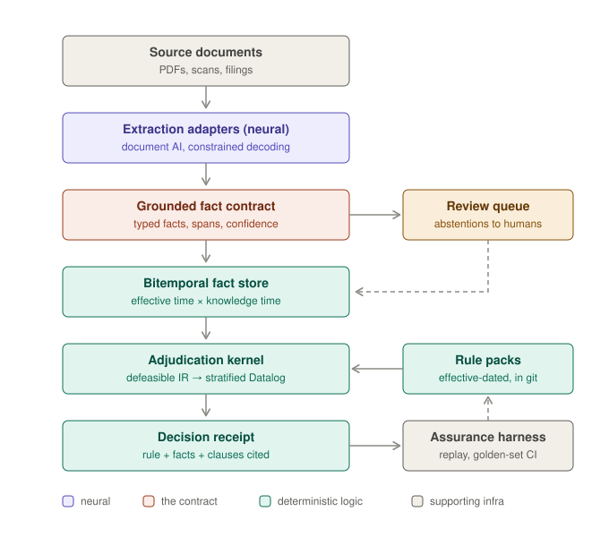

```text
██████╗ ██╗   ██╗██╗  ██╗   ██╗
██╔══██╗██║   ██║██║  ╚██╗ ██╔╝
██║  ██║██║   ██║██║   ╚████╔╝
██║  ██║██║   ██║██║    ╚██╔╝
██████╔╝╚██████╔╝███████╗██║
╚═════╝  ╚═════╝ ╚══════╝╚═╝
```

[](https://github.com/kjpatel/duly/actions/workflows/ci.yml)

**Auditable document decisioning for regulated workflows.**

*duly* — as in duly authorized, duly recorded, duly noted: in accordance with proper procedure. 

duly is an open-source toolkit for building neuro-symbolic document-decisioning systems: a neural layer reads unstructured documents and *proposes* structured facts; a deterministic symbolic layer applies a versioned, effective-dated rulebase to *decide* what those facts mean. Perception proposes, logic disposes. Every conclusion arrives with the rule that fired, the fact it fired on, and the clause the fact came from — an answer plus a receipt.

## The problem

In regulated domains — insurance manuscripts, mortgage closing packages, healthcare claims, KYC files, customs declarations — reading the documents was never the hard part. The hard part is that every conclusion must be:

- **defensible** to a regulator or auditor, citing the exact rule and the exact source text;
- **reproducible** months or years later, byte-for-byte;
- **evaluated under the rules as they stood** on the transaction date, not today's rules.

A model that is right 95% of the time and cannot show its work is unusable here, because the output isn't the answer — it's the answer plus an auditable chain. And the expensive failure mode isn't being wrong; it's being *confidently* wrong. The architecture duly supports converts confident wrongness into explicit abstention routed to a human.

The individual pieces of this architecture already exist as open source: Datalog engines, document AI, rules-as-code DSLs, graph stores, provenance vocabularies. What doesn't exist is the **seam** — a standard for how a probabilistic extractor hands facts to a deterministic reasoner with source spans, calibrated confidence, abstention semantics, and bitemporal versioning intact, plus a kernel that can replay any decision as of any date. Today, every team building one of these systems writes that layer themselves.

duly is that seam.

## Architecture

<p align="center">
  
</p>

Everything above the contract is probabilistic and replaceable; everything below it is deterministic and replayable. Extractors and models can be swapped at the contract line without touching the reasoning layer — the approach OpenTelemetry took for telemetry: standardize the interchange format, ship adapters, and let the ecosystem form around the format rather than around any single engine.

| Piece | What it is | Status |
|---|---|---|
| [Grounded fact contract](spec/grounded-facts.md) | The interchange format: facts with provenance, confidence, and bitemporal fields; decision receipts with derivation trees | v0 shipped |
| [Rule IR](spec/rule-ir.md) | Defeasible rules — priority, overrides, legal citation, effective window — in a YAML authoring format; Datalog/ASP compilation targets come later | v0 shipped |
| [Reference kernel](kernel/) | Deterministic interpreter: typed expressions (decimal-only money), stratified evaluation, defeat semantics, effective-dated rule selection, receipt emission | working, tested |
| [Audit report renderer](kernel/duly_kernel/report.py) | Deterministic derivation-tree → layered Markdown/PDF report for compliance and technical readers ([example](docs/example-audit-report.md)) | working |
| [Rule packs](rulepacks/) | Termination-notice pack covering NY, FL, and CA, plus federal TRID fee tolerance — each rule cited to its statute, with declared expected outcomes run in CI | two packs, four jurisdictions |
| [Starters](starters/) | Synthetic documents, extracted renditions, and span-verified grounded facts for both verticals | two shipped |
| [Demo](demo/) | Interactive adjudication UI: highlighted grounding spans, derivation tree, rule citations, receipts, as-of replay, and the review arc — abstention, inline correction, golden-case export | working |
| [Extraction adapters](extraction/) | Document AI providers emitting contract-conformant facts with verified run envelopes | Docling + scripted stub; commercial adapters deferred |
| [Bitemporal fact store](store/) | Append-only events, as-of projections across effective and knowledge time, supersession chains (SQLite; Postgres-portable schema) | working |
| [Review queue](review/) | Abstention routing; human corrections re-enter as first-class facts and auto-become golden cases; calibration label export | working (API + library) |
| [Calibration](calibration/) | Temperature/Platt/conformal calibrators and abstention math, consuming the review queue's labeled pairs | working |
| [Assurance harness](assurance/) | Replay verifier, 251-case [golden corpus](golden/) (250 synthetic + 1 review-born), rule-change impact analysis with CI PR comments | working |

## Design choices and why

### Why neuro-symbolic at all

Pure-LLM approaches improve with every model release, and for most document work they are the right choice. duly targets the workflows where the requirement isn't capability but accountability:

- **The audit trail is a byproduct of evaluation.** A rules engine reports which rule fired on which fact from which clause. Prompted explanations cannot provide this, because a model's stated reasoning is not its actual reasoning.
- **Rule changes are code changes, not ML projects.** When a regulation changes, you edit a rule, version it, effective-date it. Nothing retrains; nothing silently regresses elsewhere.
- **Long-tail coverage without long-tail data.** You encode a county's recording rule once instead of collecting three hundred labeled examples of it — decisive when the tail is thousands of jurisdictions with a handful of files each.
- **Failure is legible.** The system can say "insufficient grounded facts" and route to a human, converting the expensive failure mode (confident wrongness) into a manageable one (abstention).

This approach carries known risks: it assumes regulators will continue to require determinism and provenance rather than accepting model output directly, and it inherits the classic expert-systems problem that knowledge engineering never ends. Both risks shape the roadmap — the ontology is bring-your-own, and the starting point is one narrow vertical slice rather than a comprehensive knowledge graph.

### Why the focus on the seam

Engines are replaceable; interchange formats compound. Datalog engines, document parsers, and graph stores all exist and keep improving. The glue between them is where implementations diverge and break: how confidence survives the handoff, how a span stays resolvable after the extractor upgrades, how a decision made in March stays replayable in November. Standardizing that layer is where a neutral open-source project adds the most value, and it is not a layer any single vendor is positioned to define.

### Why facts are atomic, typed, and content-addressed

A fact is one entity–attribute–value assertion with mandatory grounding (a document span or a human attestation), a calibrated confidence, and two time axes. Atomic facts ground directly into Datalog relations and carry per-assertion confidence — an extractor is often sure about a notice's mailing date and unsure about its stated ground for termination, and one score per record can't express that. Money is decimal strings, never floats: binary floating point is not acceptable where amounts must reconcile to the cent under audit. Facts are content-addressed (RFC 8785 canonical JSON + SHA-256), so receipts pin their inputs by hash and replay integrity is checkable byte-for-byte. Full rationale, decision by decision, in [the spec](spec/grounded-facts.md).

### Why bitemporal from birth

"Evaluate a March file under March rules, as we understood the facts in March" is the defining query of regulated replay, and it needs two independent time axes: *effective time* (when a fact or rule applies in the world) and *knowledge time* (when the system learned it). Retrofitting bitemporality onto a unitemporal store is a rewrite; carrying two timestamps from day one is nearly free. Facts are immutable — corrections supersede, and the supersession chain *is* the correction history.

### Why a defeasible IR compiled to stratified Datalog

Real rulebases are defaults and exceptions all the way down ("standard tolerance applies *unless* the fee is in the 10% bucket *unless* a changed circumstance reset the baseline"). Full answer-set programming handles this natively, but at a cost that is hard to justify in v1: the learning curve for contributors is steep, ASP explanation tooling remains immature — a serious problem when the receipt is the primary output — and multiple answer sets complicate the determinism guarantee. Plain Datalog has the opposite problem: hand-encoded exception plumbing makes rule packs hard to read and review.

duly follows the approach [Catala](https://catala-lang.org/) established for computational law: rules carry `priority` and `unless` metadata *declaratively in the IR*, and the compiler mechanically lowers them to stratified Datalog. Authors get explicit exception semantics; the engine stays deterministic; receipts show which rule **defeated** which, making the non-monotonic reasoning itself auditable. A clingo backend can be added later for rule fragments that genuinely need it, without changing any rule pack.

### Why bring-your-own ontology

duly ships no domain schema. MISMO, ACORD, FHIR, and FIBO already exist, and building a new domain ontology is a large undertaking that has stalled many efforts in this space. Facts reference the user's ontology by CURIE + version; duly validates conformance (SHACL/LinkML gate, planned) but defines no domain terms. This boundary also contains the knowledge-engineering burden: duly's core never grows domain knowledge, so it never accumulates domain debt.

### Why code-first

Specifications that develop ahead of running code rarely get adopted. The contract was developed against real vertical slices — termination-notice compliance and TRID fee tolerance, both now running end to end — and implementation promptly forced spec revisions (recorded in [spec/rule-ir.md](spec/rule-ir.md) under "Resolved in v0"), which is exactly the point. The spec stabilizes at v1.0; until then, breaking changes are expected.

### What duly deliberately is not

- **Not a knowledge graph platform.** Graph projections (SPARQL over Oxigraph/RDFox) come when cross-document reasoning genuinely demands them, not before.
- **Not an orchestration framework.** LangGraph, Temporal, and friends compose around duly; integration examples only.
- **Not a UI product.** The review queue ships as an API with defined queue semantics; review interfaces vary too much across organizations to standardize, and are left to integrators.
- **Not an extraction model.** Adapters wrap the extractors you already use; duly's job starts at the contract line.

## The demonstration

The milestone that validates the architecture end to end now runs. Three scenarios ship with the repo — a New York homeowners nonrenewal notice, a TRID transfer-tax tolerance check between a Loan Estimate and a Closing Disclosure, and a review-arc variant of the notice case whose extracted mailing date lands below the rule pack's confidence floor:

```bash
uv sync
uv run uvicorn demo.app:app --port 8788
```

Open http://localhost:8788, pick a scenario, and ask its question — or follow the step-by-step [demo tour](docs/demo_tour.md).  The document pane highlights the exact phrases each fact was grounded in; the reasoning pane shows the derivation tree (click a fact to jump to its source sentence), the rules that fired with their legal citations, and which presumption each rule defeated; the receipt downloads as JSON and the full audit report as Markdown or PDF ([example](docs/example-audit-report.md)). Change the as-of date and the same facts produce a different outcome under the rules in force at that date — the effective-dated replay the architecture exists to provide. In the review-arc scenario the decision abstains from the below-floor fact, falls to the presumption, and says so; an inline correction supersedes the shaky fact with a human-asserted one, flips the verdict on re-adjudication, and exports as a replayable golden regression case ([tour §9](docs/demo_tour.md)).

Honest labels on the demo content: the documents are synthetic (generated by [starters/tools](starters/tools/), with facts span-verified against the actual PDF text); extraction runs the Docling adapter when the `extraction` extra is installed and the honest scripted stub otherwise, with the UI labeling which extractor produced the rendition; the review-arc scenario's 0.62 confidence is scripted so the abstention arc is reproducible; and the pre-2026 "30-day" historical rule version exists only to demonstrate effective-dated replay — it is marked `DEMO-SYNTHETIC` in the pack and is not real statutory history.

## Roadmap

Sequencing principle: build nothing until its consumer exists. Each milestone ends in something demonstrable.

### M0 — the contract (complete)
- [x] Grounded fact spec: ten design decisions with rationale ([spec/grounded-facts.md](spec/grounded-facts.md))
- [x] JSON Schemas for `GroundedFact` and `DecisionReceipt`
- [x] Worked example with real content hashes: New York nonrenewal notice-period check (N.Y. Ins. Law § 3425)
- [x] Validator: schema + hash + referential-integrity checks

### M1 — end-to-end vertical slice (complete)
- [x] Rule IR: defeasible rules with priority, overrides, legal citation, and effective window ([spec/rule-ir.md](spec/rule-ir.md), including two design questions resolved during implementation)
- [x] Reference interpreter (pure Python, optimized for derivation-trace quality, not speed)
- [x] Two starters end to end — NY termination notice and federal TRID fee tolerance: sample documents → facts → adjudication → receipt
- [x] Interactive demo UI: grounding-span highlighting, derivation tree, citations, defeated-rule badges, as-of replay
- [x] First end-to-end run of the target demonstration (the as-of outcome flip)
- [x] Audit report renderer: deterministic, layered Markdown + PDF ([example report](docs/example-audit-report.md)), with PII quote redaction
- [x] Spec closeout: conflict-resolution policy (a lone human assertion outranks machine facts; all other conflicts abstain) and fact `sensitivity` field — both implemented and tested; batch envelopes deferred to M3

### M2 — replay and regression (complete)
- [x] Bitemporal fact store ([store/](store/)): append-only events on SQLite with a Postgres-portable schema; as-of projections across knowledge and effective time; supersession chains and knowledge-time travel ("what did we know in March") tested end to end
- [x] Replay verifier: `python -m duly_assurance verify` re-adjudicates every golden case and asserts byte-identical receipts
- [x] Golden corpus ([golden/](golden/)): 250 committed synthetic cases with receipts, seeded and deterministically regenerable, exercising every rule in every pack including effective-date boundaries and defeat chains
- [x] Rule-change impact analysis in CI: PRs touching rulepacks/ get a sticky comment — "N of M decisions flip" — with before/after receipts and reasoning-only-change tracking ([.github/workflows/ci.yml](.github/workflows/ci.yml))
- [x] Florida and California rule packs, statutorily verified (Fla. Stat. § 627.4133; Cal. Ins. Code §§ 678, 677.4) with explicit scope comments and TODO(verify) markers; jurisdiction scoping validated by equality-guard disjointness in the pack validator

### M3 — extraction and review
- [x] Extraction adapter interface + Docling adapter ([extraction/](extraction/)): rendition-anchored spans verified on every emission; the demo's scripted stub is adapter #1 behind the same contract
- [ ] One commercial extraction adapter (Azure DI or Google Document AI) — deferred; the adapter contract is the seam it plugs into
- [x] Human corrections auto-become golden regression cases (moved from M2; depends on the review queue): `python -m duly_review golden` freezes a resolved item as a replayable `review-*` case — one committed ([review-0001](golden/cases/review-0001)), regenerated byte-identically in tests
- [x] Extraction-run batch envelope: content-addressed manifest so a whole run can be verified or revoked at once (deferred from M0; [envelope.py](extraction/duly_extraction/envelope.py), spec resolved question 4 — asymmetric signatures remain an open question)
- [x] Calibration module (temperature/Platt/conformal) with abstention policy hooks ([calibration/](calibration/)): pack-level `abstentionPolicy` confidence floors in the kernel, labeled-pair export from the review queue
- [x] Review queue API: abstention routing (pack-level `abstentionPolicy.routeTo` → receipt `routedTo`), human facts re-entering the store through its public API, dedup'd append-only queue with FastAPI surface ([review/](review/)), and calibration label export (with its censored-sample caveat stated where the labels come out)
- [x] Demo integration — the review arc in the browser ([demo tour §9](docs/demo_tour.md)): startup extraction into a per-process fact store, a below-floor fact abstaining to the presumption, an inline human correction that supersedes it and flips the decision, and one-click export of the resolution as a golden-case bundle

### M4 — backends and standards alignment
- [ ] Soufflé backend for large fact volumes; Z3/OR-Tools for arithmetic and timing constraints
- [ ] DMN decision-table authoring surface compiling to the same IR (compliance edits without a deploy)
- [ ] SHACL/LinkML ontology conformance gate
- [ ] PROV-O JSON-LD context for facts and receipts

### v1.0 — specification stability
- [ ] Spec freeze with versioning policy
- [ ] Second starter vertical: claims coverage determination against a synthetic manuscript — grant → exclusion → exception chains as a full defeasible-reasoning showcase
- [ ] Rule-pack authoring guide and contribution pipeline

## Contribution model

The project is structured so that the two largest contribution surfaces sit at the edges of the contract, where domain knowledge matters more than familiarity with the core:

- **Rule packs** — domain experts (analysts, lawyers, compliance engineers) contribute versioned, cited, effective-dated rules for their jurisdiction or program. [OpenFisca](https://openfisca.org/)'s country packages demonstrate that this contribution model works.
- **Extraction adapters** — vendors and users of a given document AI service can maintain its adapter independently, the way observability vendors maintain OpenTelemetry exporters.

A small core maintains the specification and kernel; the edges grow with the ecosystem.

## Relationship to prior art

duly stands on, and deliberately does not rebuild: [OpenFisca](https://openfisca.org/) (rules-as-code with effective-dated parameters), [Catala](https://catala-lang.org/) (default logic for statutes — the IR's direct inspiration), [Docling](https://github.com/docling-project/docling) (document parsing), [Outlines](https://github.com/dottxt-ai/outlines) (schema-constrained decoding), [Soufflé](https://souffle-lang.github.io/) / [clingo](https://potassco.org/clingo/) / [Z3](https://github.com/Z3Prover/z3) (evaluation backends), [XTDB](https://xtdb.com/) (bitemporality as default), [PROV-O](https://www.w3.org/TR/prov-o/) and [SHACL](https://www.w3.org/TR/shacl/) (provenance and validation vocabularies), and [DMN](https://www.omg.org/dmn/) (business-editable decision tables). What none of them cover is the seam between perception and adjudication — that is duly's entire scope.

## Status

Pre-alpha; M0, M1, and M2 are complete ([v0.2.0](https://github.com/kjpatel/duly/releases/tag/v0.2.0)), and M3 — extraction adapters, run envelopes, calibration, the review queue, and the browser review arc — is complete except for a commercial extraction adapter, which is deferred. The contract and rule IR are drafted, the reference kernel adjudicates three state notice packs and federal TRID fee tolerance deterministically, the interactive demonstration runs the full abstain → correct → flip → golden-case loop, and 251 golden decisions (250 synthetic + 1 review-born) replay byte-for-byte on every push. Verify everything locally:

```bash
uv sync
uv run pytest kernel/tests demo/tests assurance/tests store/tests calibration/tests extraction/tests review/tests   # full suite
uv run python -m duly_assurance verify  # replay all 251 golden receipts byte-for-byte
uv run spec/validate.py                 # spec examples: schemas + hashes
uv run uvicorn demo.app:app --port 8788 # the interactive demo
```

Breaking changes remain expected until v1.0. Feedback on the spec's [open questions](spec/grounded-facts.md#open-questions) and the [rule IR](spec/rule-ir.md) is the most useful contribution right now.

## License

[Apache-2.0](LICENSE)
