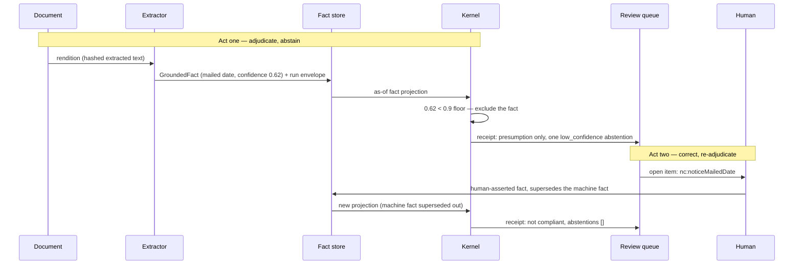

# Follow one fact

The [README](../README.md) argues the architecture and the [spec](../spec/grounded-facts.md) justifies it decision by decision; the [demo tour](demo_tour.md) walks the UI. This document walks the **data**. It follows a single fact — the mailing date of a New York notice of nonrenewal, attribute `nc:noticeMailedDate` — from ink on a synthetic PDF, through extraction, hashing, and adjudication, into a decision receipt, and then through the review arc: the same attribute extracted badly, abstained on, corrected by a human, and re-adjudicated to the opposite verdict.

Every JSON block below is copied from a file committed in this repository, with its path in the caption. Nothing is invented, and every hash shown re-derives from the committed bytes (the snippets that check this are included, and run).



## 1. The document

The source is a committed synthetic PDF, [`examples/starters/notice-ny/documents/nonrenewal-notice.pdf`](../examples/starters/notice-ny/documents/nonrenewal-notice.pdf). Its SHA-256 — which every fact extracted from it will carry — is:

```
$ shasum -a 256 examples/starters/notice-ny/documents/nonrenewal-notice.pdf
638dbca9307b198efc5b2e85e2bce3877628078f03ac8d5fda350f51d95d9fcd
```

Character offsets against "the PDF" are meaningless — every extractor produces different text from the same bytes — so spans are defined against a **rendition**: the immutable extracted text, retained as long as the facts derived from it ([spec D4](../spec/grounded-facts.md#d4-spans-reference-a-hashed-document-rendition)). The committed rendition is [`examples/starters/notice-ny/renditions/nonrenewal-notice.txt`](../examples/starters/notice-ny/renditions/nonrenewal-notice.txt); its first four lines:

```text
HOMESTEAD MUTUAL INSURANCE COMPANY
NOTICE OF NONRENEWAL

Date of Mailing: July 25, 2026
```

Offsets are Unicode code points, end-exclusive ([spec, resolved question 1](../spec/grounded-facts.md#resolved-questions)). Line 1 occupies offsets 0–33 with its newline at 34; line 2 is 35–54, newline 55; the blank line is the newline at 56; so `Date of Mailing: July 25, 2026` occupies **[57, 87)**. Hold that span — it reappears in stage 3.

## 2. The extraction instruction

The starter pipeline is an honest stub: instead of a model proposing facts, a committed **targets file** lists what to extract and the exact quote to ground it in, and the stub adapter locates each quote in the rendition by substring search ([`examples/starters/tools/extract.py`](../examples/starters/tools/extract.py), a CLI over [`extraction/duly_extraction/stub.py`](../extraction/duly_extraction/stub.py)). A real deployment swaps in a document-AI extractor that emits the same contract; the Docling adapter ([`extraction/duly_extraction/docling_adapter.py`](../extraction/duly_extraction/docling_adapter.py)) already does, producing its own rendition and measuring its own spans. The mailed-date entry:

```jsonc
// examples/starters/tools/targets/notice-ny-nonrenewal-notice.json
{
  "documentId": "doc:nonrenewal-notice:HO-77401-NY:2026-07-25",
  "caseId": "case:policy:HO-77401-NY",
  "schemaRef": {
    "ontology": "duly-starter-notice",
    "version": "0.1.0"
  },
  "assertedAt": "2026-07-28T14:06:02Z",
  "runId": "run:2026-07-28:007",
  "page": 1,
  "facts": [
    {
      "file": "fact-notice-mailed.json",
      "entity": {
        "id": "notice:HO-77401-NY:2026-07-25",
        "type": "nc:TerminationNotice"
      },
      "attribute": "nc:noticeMailedDate",
      "value": {
        "kind": "date",
        "value": "2026-07-25"
      },
      "quote": "Date of Mailing: July 25, 2026",
      "confidence": {
        "score": 0.989,
        "method": "conformal",
        "calibrationRef": "cal:notice-docs:2026-06"
      }
    }
    // … trimmed: one more entry (nc:noticeType, quote "NOTICE OF NONRENEWAL")
  ]
}
```

One target = one quote + one entity–attribute–value triple + a confidence. The stub turns each into a `GroundedFact`; the confidence is scripted here (that's what makes the abstention arc in act one reproducible), where a real adapter would emit a calibrated score.

## 3. The grounded fact

What extraction commits to disk — the fact this whole document follows, in full:

```json
// examples/starters/notice-ny/facts/fact-notice-mailed.json
{
  "id": "urn:duly:fact:sha256:3cbbd14b0d2f0db140d2eaa86186b3319a7348cfc93d5a95fccab3abb97ca953",
  "contentHash": "3cbbd14b0d2f0db140d2eaa86186b3319a7348cfc93d5a95fccab3abb97ca953",
  "caseId": "case:policy:HO-77401-NY",
  "entity": {
    "id": "notice:HO-77401-NY:2026-07-25",
    "type": "nc:TerminationNotice"
  },
  "attribute": "nc:noticeMailedDate",
  "value": {
    "kind": "date",
    "value": "2026-07-25"
  },
  "grounding": {
    "kind": "document",
    "documentId": "doc:nonrenewal-notice:HO-77401-NY:2026-07-25",
    "documentSha256": "638dbca9307b198efc5b2e85e2bce3877628078f03ac8d5fda350f51d95d9fcd",
    "rendition": {
      "id": "rend:demo-extractor:0.1.0:638dbca9",
      "extractor": "duly-demo-extractor",
      "extractorVersion": "0.1.0"
    },
    "page": 1,
    "charSpan": {
      "start": 57,
      "end": 87
    },
    "quote": "Date of Mailing: July 25, 2026"
  },
  "assertion": {
    "kind": "machine",
    "at": "2026-07-28T14:06:02Z",
    "extractor": {
      "name": "duly-demo-extractor",
      "version": "0.1.0",
      "runId": "run:2026-07-28:007"
    }
  },
  "confidence": {
    "score": 0.989,
    "method": "conformal",
    "calibrationRef": "cal:notice-docs:2026-06"
  },
  "recordedAt": "2026-07-28T14:06:02Z",
  "status": "asserted",
  "schemaRef": {
    "ontology": "duly-starter-notice",
    "version": "0.1.0"
  }
}
```

Field by field:

- **`entity` / `attribute` / `value`** — one atomic assertion: this notice's mailed date is 2026-07-25. Complex records decompose into many such facts sharing an entity id ([D1](../spec/grounded-facts.md#d1-facts-are-atomic-entityattributevalue-assertions)); values are typed, and numbers would be decimal strings, never floats ([D2](../spec/grounded-facts.md#d2-values-are-typed-numbers-are-decimal-strings-money-carries-currency)).
- **`grounding`** — the mandatory "where from": the document hash from stage 1, the rendition it was read from, the span **[57, 87)**, and the quote so receipts can render without document access ([D3](../spec/grounded-facts.md#d3-every-fact-says-where-it-came-from-a-span-or-an-attestation), [D4](../spec/grounded-facts.md#d4-spans-reference-a-hashed-document-rendition)).
- **`assertion`** — who claims it: a machine, with extractor name, version, and run id. A human assertion has the same shape with an actor instead ([D9](../spec/grounded-facts.md#d9-human-and-machine-assertions-share-one-shape)) — stage 7 shows one.
- **`confidence`** — a calibrated score plus its method. Note what is *absent*: no "abstained" flag. Whether 0.989 is good enough is adjudication policy, versioned with the rule pack, applied by the kernel at decision time ([D5](../spec/grounded-facts.md#d5-confidence-is-a-calibrated-score-plus-its-method-abstention-is-policy-not-data)).
- **`recordedAt`** — knowledge time: when the system learned this. Effective time (`effectiveFrom` / `effectiveTo`) is the other axis and is omitted here, which the schema defines as unbounded ([D6](../spec/grounded-facts.md#d6-bitemporal-from-birth)).
- **`status`** — `asserted`; a fact is never edited, only superseded or retracted by later events ([D7](../spec/grounded-facts.md#d7-facts-are-immutable-corrections-supersede)).
- **`contentHash` / `id`** — the fact is content-addressed ([D8](../spec/grounded-facts.md#d8-facts-are-content-addressed)): `contentHash` is the SHA-256 of the canonical JSON (RFC 8785 subset: sorted keys, minimal separators, UTF-8) of the fact *excluding* `id` and `contentHash` themselves, and the id is just `urn:duly:fact:sha256:` + that hash. No id-issuing authority anywhere.

Neither claim needs to be taken on faith. The span really does resolve to the quote:

```python
text = open("examples/starters/notice-ny/renditions/nonrenewal-notice.txt", encoding="utf-8").read()
assert text[57:87] == "Date of Mailing: July 25, 2026"
```

and the hash really does re-derive from the committed bytes:

```python
import hashlib, json
fact = json.load(open("examples/starters/notice-ny/facts/fact-notice-mailed.json"))
body = {k: v for k, v in fact.items() if k not in ("id", "contentHash")}
digest = hashlib.sha256(json.dumps(body, sort_keys=True, separators=(",", ":"),
                                   ensure_ascii=False).encode("utf-8")).hexdigest()
assert digest == fact["contentHash"] == fact["id"].removeprefix("urn:duly:fact:sha256:")
```

Neither check is special to this document: `uv run spec/validate.py` verifies the hash of every spec example on every push, `uv run python examples/starters/tools/check_facts.py` runs the span check (and the hash check) over every committed starter fact, and the extraction adapters re-verify each span on every emission ([`extraction/duly_extraction/adapter.py`](../extraction/duly_extraction/adapter.py)).

## 4. The run envelope

Facts do not arrive one by one; an extraction run emits an **envelope** per rendition — a manifest of the adapter, the document hash, the rendition hash, and the ordered, complete list of fact ids the run proposed — content-addressed as a unit, so a consumer can verify or revoke a whole run at once ([spec, resolved question 4](../spec/grounded-facts.md#resolved-questions)). The committed example is the **declarations-page** run from the same insurance case (the notice document's envelopes are produced at demo startup and live in the session store, not the repo — the mechanics are identical):

```json
// spec/examples/envelopes/envelope-decpage-run.json
{
  "id": "urn:duly:run:sha256:d5cd28e06e82ffd0991a194b6303da8be5abda75232b43f91512cc7a9322ffab",
  "contentHash": "d5cd28e06e82ffd0991a194b6303da8be5abda75232b43f91512cc7a9322ffab",
  "runId": "run:2026-07-28:003",
  "adapter": {
    "name": "duly-docling-adapter",
    "version": "0.1.0",
    "modelId": "docling-2.15.0"
  },
  "documentId": "doc:dec-page:HO-77401-NY:2025-09-01",
  "documentSha256": "5c1e8a7b3d9f2c4e6a0b8d1f3a5c7e9b2d4f6a8c0e1b3d5f7a9c2e4b6d8f0a1c",
  "rendition": {
    "id": "rend:docling:2.15.0:5c1e8a7b",
    "sha256": "8f3a1c5e7b9d2f4a6c8e0b1d3f5a7c9e2b4d6f8a0c1e3b5d7f9a2c4e6b8d0f1a"
  },
  "createdAt": "2026-07-28T14:05:41Z",
  "factIds": [
    "urn:duly:fact:sha256:692e8e631175771126d6e59aa47d10c00b11a856cfd4e8e34e6a018126b65a8d",
    "urn:duly:fact:sha256:6cf5e71b99495ce34fe4fade80aa2752d30248db63b43f76d03bc8b94bc883b0"
  ]
}
```

The two `factIds` are the content hashes of [`spec/examples/fact-decpage-expiration.json`](../spec/examples/fact-decpage-expiration.json) and [`spec/examples/fact-decpage-state.json`](../spec/examples/fact-decpage-state.json) — the run's membership is pinned to exact fact contents, not to names. The envelope's own `contentHash` is computed by the same D8 rule as a fact's (and re-derives; same snippet, different file). Honest footnote: this spec fixture's `documentSha256` and `rendition.sha256` are illustrative values, unlike the starter facts, whose document hashes are the real hashes of the committed PDFs (compare stage 3's `638dbca9…`, or `shasum -a 256 examples/starters/notice-ny/documents/dec-page.pdf` against [`examples/starters/notice-ny/facts/fact-decpage-expiration.json`](../examples/starters/notice-ny/facts/fact-decpage-expiration.json)). The producer and verifier live in [`extraction/duly_extraction/envelope.py`](../extraction/duly_extraction/envelope.py); at demo startup every envelope is verified — manifest hash, every fact hash, every span against the rendition — before its facts are ingested ([demo tour §9](demo_tour.md#9-the-review-arc)).

## 5. The store

Ingestion appends events; nothing is ever updated in place. The bitemporal store ([`store/`](../store/)) records each fact with its knowledge time and serves **as-of projections**: "the live facts of this case, as known at time K, effective at time E" ([D6](../spec/grounded-facts.md#d6-bitemporal-from-birth), [D7](../spec/grounded-facts.md#d7-facts-are-immutable-corrections-supersede)). Supersession — coming in stage 7 — is likewise an event plus a projection: the old fact's record is untouched, its `superseded` status is computed, and a projection at an earlier knowledge time still shows the world as it was believed then. Every adjudication below runs against such a projection, and the golden corpus ([examples/golden/README.md](../examples/golden/README.md)) replays them continuously.

## 6. Adjudication, act one: the abstention

The rulebase is [`examples/rulepacks/termination-notice-us-states/pack.yaml`](../examples/rulepacks/termination-notice-us-states/pack.yaml) (version 2026.3.0). Two of its rules star here: **NY-NR-45** derives `nc:requiredMinimumNoticeDays = 45` for a New York nonrenewal (citing N.Y. Ins. Law § 3425(d)(1)), and **NC-NR-01** (priority 200) concludes non-compliance when `days_between(mailed, expiration) < minDays`, overriding the priority-0 presumption of compliance, **NC-DEF-00**. The pack also carries the adjudication-time confidence policy — this block is why act one abstains:

```yaml
# examples/rulepacks/termination-notice-us-states/pack.yaml
abstentionPolicy:
  minConfidence: 0.75
  attributes:
    nc:noticeMailedDate: 0.9
```

The stage-3 fact, at confidence 0.989, clears the 0.9 attribute floor; the straight-through adjudication binds it and concludes **not compliant** — 2026-07-25 to the dec page's expiration 2026-09-01 is 38 days, short of 45. That receipt is committed at [`spec/examples/receipt-ny-nonrenewal-notice.json`](../spec/examples/receipt-ny-nonrenewal-notice.json).

The review arc re-runs the *same* document with the mailing date read badly — confidence **0.62**, below the 0.9 floor. Honest accounting of where that act lives in the repo, because the post-correction golden receipt in stage 8 no longer shows it:

- The demo ingests the notice document with the scripted 0.62 score ([`duly_demo/app.py`](../duly_demo/app.py), `REVIEW_MAILED_CONFIDENCE = {"score": 0.62, "method": "platt"}`), and [`duly_demo/tests/test_review_arc.py`](../duly_demo/tests/test_review_arc.py) pins the resulting abstention: reason `low_confidence`, attribute `nc:noticeMailedDate`, score 0.62 against floor 0.9, floor source `attribute` from pack `termination-notice-us-states` — and the decision falling to the presumption: an amber *Compliant*, "presumption only".
- The committed golden case [`review-0001`](../examples/golden/cases/review-0001) freezes the *resolved* arc, so its receipt is post-correction. The pre-correction receipt is not committed; [`review/tests/test_golden.py`](../review/tests/test_golden.py) replays the whole arc from fixed constants — asserting the `low_confidence` abstention on the first adjudication — and regenerates the committed case byte-identically from the second.
- The corpus does commit receipts with live abstention entries — in the county-recording pack, whose review scenario abstains the same way. The entry, verbatim, so you can see the shape the notice arc produces too:

```json
// examples/golden/receipts/rec-0015.json, "abstentions" (a county-recording case; the notice arc's entry has the same shape)
[
  {
    "entity": "submission:rec-0015",
    "attribute": "rec:firstPageTopSpaceInches",
    "reason": "low_confidence",
    "facts": [
      "urn:duly:fact:sha256:53f5a3dc45a0565aa475bb54a217f279a1546c2d752799a0f5eefccc8976efe4"
    ],
    "confidence": {
      "score": 0.8,
      "method": "conformal"
    },
    "threshold": {
      "minConfidence": 0.85,
      "source": "attribute",
      "pack": "county-recording-us",
      "packVersion": "2026.1.0"
    },
    "routedTo": "recording-review"
  }
]
```

Read the entry against [the receipt schema's commitments](../spec/grounded-facts.md#decision-receipts): the excluded fact is named by id (it is still a grounded fact — the demo will still jump to its document span when you click it), the score and the floor are both recorded *with the floor's provenance* (pack, version, attribute override vs. default), and `routedTo` hands it to the review queue. Abstention lives on the receipt, never on the fact ([D5](../spec/grounded-facts.md#d5-confidence-is-a-calibrated-score-plus-its-method-abstention-is-policy-not-data)) — the same fact may clear one pack's floor and miss another's.

## 7. The correction

A reviewer opens the queue item, confirms what the extractor read but could not vouch for, and the correction enters the store as a first-class fact. From the committed golden case, in full:

```json
// examples/golden/cases/review-0001/facts/nc-noticeMailedDate.json
{
  "assertion": {
    "actor": {
      "id": "reviewer:rq-demo",
      "role": "compliance-review"
    },
    "at": "2026-07-28T09:00:00Z",
    "kind": "human"
  },
  "attribute": "nc:noticeMailedDate",
  "caseId": "case:review:0001",
  "contentHash": "87ee4342784c35ef969844a91b6a6d4e4a3a4b32aeb48d87cebf6040c0f3419e",
  "entity": {
    "id": "notice:review-0001",
    "type": "nc:TerminationNotice"
  },
  "grounding": {
    "actor": "reviewer:rq-demo",
    "at": "2026-07-28T09:00:00Z",
    "channel": "review-queue",
    "kind": "attestation"
  },
  "id": "urn:duly:fact:sha256:87ee4342784c35ef969844a91b6a6d4e4a3a4b32aeb48d87cebf6040c0f3419e",
  "recordedAt": "2026-07-28T09:00:00Z",
  "schemaRef": {
    "ontology": "duly-starter-notice",
    "version": "0.1.0"
  },
  "status": "asserted",
  "supersedes": "urn:duly:fact:sha256:88e14fe4073b92b310b98cd6f787fc4272833f3d03d0c9dd6b175f9698e42b3f",
  "value": {
    "kind": "date",
    "value": "2026-07-25"
  }
}
```

The same contract as stage 3, with three differences worth staring at:

- **`assertion.kind: "human"`** with an actor id and role — not a separate "correction" record type. A human correction is just another fact, which is what lets everything downstream consume it unchanged ([D9](../spec/grounded-facts.md#d9-human-and-machine-assertions-share-one-shape)).
- **`grounding.kind: "attestation"`** — this value exists in no document span; its provenance is *who said so, through what channel, when*. Forcing it into a fake span would corrupt the provenance story exactly where it matters ([D3](../spec/grounded-facts.md#d3-every-fact-says-where-it-came-from-a-span-or-an-attestation)). No `confidence` block: confidence is for machine assertions.
- **`supersedes`** — pointing at the content-address of the 0.62 machine fact. That fact is not a file in this case directory, deliberately: the case's `facts/` is a store projection at the resolution's knowledge time (`2026-07-28T09:00:00Z`), and a superseded fact is no longer live in it. The machine fact survives in the store's event log and in any earlier-knowledge-time projection, and [`review/tests/reviewtest_helpers.py`](../review/tests/reviewtest_helpers.py) reconstructs it byte-identically (score 0.62, method platt, same date value — hash `88e14fe4…`). The demo's [evidence browser](demo_tour.md#11-the-evidence-browser) is this paragraph as an interface: run the same arc in the review-arc scenario, then drag its knowledge dial back one stop and watch the correction become not-yet-known and the 0.62 fact return to live. Whether a queue resolution *must* supersede, or may merely outrank, is [spec open question 2](../spec/grounded-facts.md#open-questions); this arc uses the supersession form.

The other three facts in [`examples/golden/cases/review-0001/facts/`](../examples/golden/cases/review-0001/facts) — notice type, governing state, policy expiration — are the machine facts, untouched: the reviewer ruled on one fact, and only that fact's history changed ([D7](../spec/grounded-facts.md#d7-facts-are-immutable-corrections-supersede)).

## 8. Adjudication, act two: the flip

Re-adjudicating the post-correction projection produces the committed golden receipt, in full:

```json
// examples/golden/receipts/review-0001.json
{
  "id": "urn:duly:receipt:sha256:748550d046122074633fbb75fd113e57d540703971d4e9bea6e1ee26244b3ce3",
  "receiptSha256": "748550d046122074633fbb75fd113e57d540703971d4e9bea6e1ee26244b3ce3",
  "caseId": "case:review:0001",
  "decision": {
    "entity": "notice:review-0001",
    "attribute": "nc:noticeCompliant",
    "value": {
      "kind": "boolean",
      "value": false
    }
  },
  "asOf": {
    "effective": "2026-07-25T00:00:00Z",
    "knowledge": "2026-07-28T09:00:00Z"
  },
  "rulePack": {
    "name": "termination-notice-us-states",
    "version": "2026.3.0"
  },
  "rulesFired": [
    {
      "ruleId": "NY-NR-45",
      "version": "1.1.0",
      "citation": {
        "text": "N.Y. Ins. Law § 3425(d)(1)",
        "url": "https://www.nysenate.gov/legislation/laws/ISC/3425"
      },
      "priority": 100,
      "effectiveFrom": "2026-01-01T00:00:00Z",
      "defeated": []
    },
    {
      "ruleId": "NC-NR-01",
      "version": "1.0.2",
      "citation": {
        "text": "N.Y. Ins. Law § 3425(d)(1)",
        "url": "https://www.nysenate.gov/legislation/laws/ISC/3425"
      },
      "priority": 200,
      "effectiveFrom": "1986-01-01T00:00:00Z",
      "defeated": [
        "NC-DEF-00"
      ]
    }
  ],
  "derivation": {
    "conclusion": {
      "entity": "notice:review-0001",
      "attribute": "nc:noticeCompliant",
      "value": {
        "kind": "boolean",
        "value": false
      }
    },
    "rule": "NC-NR-01",
    "premises": [
      {
        "factId": "urn:duly:fact:sha256:120aa512de9a7d141df12d8e8a8c96aa7fd2bdf38c41b4a759910dd351676bd8"
      },
      {
        "factId": "urn:duly:fact:sha256:87ee4342784c35ef969844a91b6a6d4e4a3a4b32aeb48d87cebf6040c0f3419e"
      },
      {
        "conclusion": {
          "entity": "notice:review-0001",
          "attribute": "nc:requiredMinimumNoticeDays",
          "value": {
            "kind": "decimal",
            "value": "45"
          }
        },
        "rule": "NY-NR-45",
        "premises": [
          {
            "factId": "urn:duly:fact:sha256:2e35314c5453cc4f159bd58e281ecfd10329c24886a1780e3bda621f46ebb910"
          },
          {
            "factId": "urn:duly:fact:sha256:76456b2f689a9dc5b10112742bf6bc11ff02a90d40883b4122efa633d2863a54"
          }
        ]
      }
    ]
  },
  "inputFacts": [
    {
      "id": "urn:duly:fact:sha256:120aa512de9a7d141df12d8e8a8c96aa7fd2bdf38c41b4a759910dd351676bd8",
      "contentHash": "120aa512de9a7d141df12d8e8a8c96aa7fd2bdf38c41b4a759910dd351676bd8"
    },
    {
      "id": "urn:duly:fact:sha256:87ee4342784c35ef969844a91b6a6d4e4a3a4b32aeb48d87cebf6040c0f3419e",
      "contentHash": "87ee4342784c35ef969844a91b6a6d4e4a3a4b32aeb48d87cebf6040c0f3419e"
    },
    {
      "id": "urn:duly:fact:sha256:2e35314c5453cc4f159bd58e281ecfd10329c24886a1780e3bda621f46ebb910",
      "contentHash": "2e35314c5453cc4f159bd58e281ecfd10329c24886a1780e3bda621f46ebb910"
    },
    {
      "id": "urn:duly:fact:sha256:76456b2f689a9dc5b10112742bf6bc11ff02a90d40883b4122efa633d2863a54",
      "contentHash": "76456b2f689a9dc5b10112742bf6bc11ff02a90d40883b4122efa633d2863a54"
    }
  ],
  "abstentions": [],
  "engine": {
    "kernel": "duly-kernel",
    "version": "0.0.1",
    "backend": "reference"
  }
}
```

Reading it top to bottom:

- **`decision`** — `nc:noticeCompliant = false`. The verdict flipped: act one's presumption-only *compliant* is gone because the mailed date now binds — 2026-07-25 to expiration 2026-09-01 is 38 days against the 45-day minimum.
- **`asOf`** — knowledge time `2026-07-28T09:00:00Z` is the correction's timestamp: this decision is evaluated *as of knowing the correction*. Replay the case at an earlier knowledge time and you get act one back, abstention and all.
- **`rulesFired`** — NY-NR-45 establishes the minimum; NC-NR-01 finds the deficiency and records that it **defeated NC-DEF-00**, the presumption. The defeat is on the receipt because the non-monotonic step is precisely what an auditor needs to see.
- **`derivation`** — a proof tree. The second premise of NC-NR-01 is `87ee4342…` — the *human* fact from stage 7, bound where the machine fact used to be. The four premise ids resolve to the four files in `examples/golden/cases/review-0001/facts/`: `120aa512…` is the policy expiration, `87ee4342…` the corrected mailed date, `2e35314c…` the notice type, and `76456b2f…` the governing state. Every leaf of the tree is a content-addressed fact with a grounding.
- **`abstentions": []`** — empty, because the below-floor fact is superseded out of the projection; nothing in the case's live facts was excluded before the rules ran.
- **`receiptSha256`** — the receipt is content-addressed the same way facts are (canonical JSON minus `id` and `receiptSha256`). `uv run python -m duly_assurance verify` re-adjudicates this case — and 350 others — from its committed facts and asserts the receipt re-derives byte-for-byte, on every push.

## Where this leaves you

One attribute, `nc:noticeMailedDate`, appeared in every artifact the architecture defines: a hashed span in a rendition, a target, a content-addressed fact, an envelope's membership list, a store projection, an abstention entry, a supersession link, and two receipts with opposite verdicts — every hop verifiable from the committed bytes. To go deeper: the contract's rationale is [spec/grounded-facts.md](../spec/grounded-facts.md), the rule semantics are [spec/rule-ir.md](../spec/rule-ir.md), the corpus rules are [examples/golden/README.md](../examples/golden/README.md), authoring a pack is [examples/rulepacks/README.md](../examples/rulepacks/README.md), and the interactive version of both acts is [demo tour §9](demo_tour.md#9-the-review-arc).
